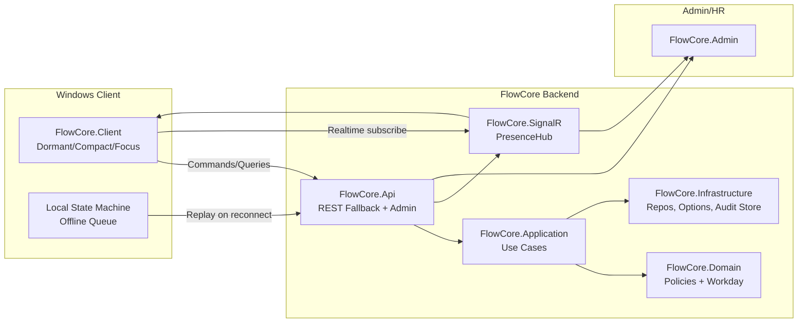

# Component Diagram (Mermaid)

```mermaid
flowchart LR
    subgraph ClientSide[Windows Client]
        ClientShell[FlowCore.Client\nDormant/Compact/Focus]
        LocalState[Local State Machine\nOffline Queue]
    end

    subgraph Backend[FlowCore Backend]
        Api[FlowCore.Api\nREST Fallback + Admin]
        Hub[FlowCore.SignalR\nPresenceHub]
        App[FlowCore.Application\nUse Cases]
        Domain[FlowCore.Domain\nPolicies + Workday]
        Infra[FlowCore.Infrastructure\nRepos, Options, Audit Store]
    end

    subgraph AdminViews[Admin/HR]
        AdminUI[FlowCore.Admin]
    end

    ClientShell -->|Commands/Queries| Api
    ClientShell -->|Realtime subscribe| Hub
    LocalState -->|Replay on reconnect| Api
    Api --> App --> Domain
    App --> Infra
    Api --> Hub
    Hub --> ClientShell
    Hub --> AdminUI
    Api --> AdminUI
```
