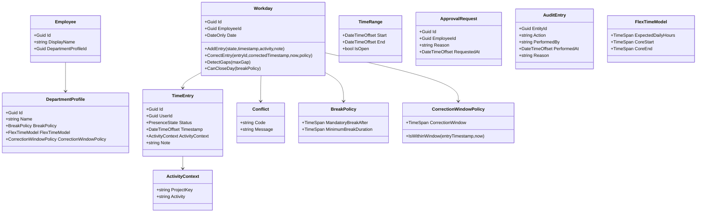

# Domain Model (Mermaid)

```mermaid
classDiagram
    class Employee {
      +Guid Id
      +string DisplayName
      +Guid DepartmentProfileId
    }

    class DepartmentProfile {
      +Guid Id
      +string Name
      +BreakPolicy BreakPolicy
      +FlexTimeModel FlexTimeModel
      +CorrectionWindowPolicy CorrectionWindowPolicy
    }

    class Workday {
      +Guid Id
      +Guid EmployeeId
      +DateOnly Date
      +AddEntry(state,timestamp,activity,note)
      +CorrectEntry(entryId,correctedTimestamp,now,policy)
      +DetectGaps(maxGap)
      +CanCloseDay(breakPolicy)
    }

    class TimeEntry {
      +Guid Id
      +Guid UserId
      +PresenceState Status
      +DateTimeOffset Timestamp
      +ActivityContext ActivityContext
      +string Note
    }

    class ActivityContext {
      +string ProjectKey
      +string Activity
    }

    class TimeRange {
      +DateTimeOffset Start
      +DateTimeOffset End
      +bool IsOpen
    }

    class ApprovalRequest {
      +Guid Id
      +Guid EmployeeId
      +string Reason
      +DateTimeOffset RequestedAt
    }

    class Conflict {
      +string Code
      +string Message
    }

    class AuditEntry {
      +Guid EntityId
      +string Action
      +string PerformedBy
      +DateTimeOffset PerformedAt
      +string Reason
    }

    class BreakPolicy {
      +TimeSpan MandatoryBreakAfter
      +TimeSpan MinimumBreakDuration
    }

    class FlexTimeModel {
      +TimeSpan ExpectedDailyHours
      +TimeSpan CoreStart
      +TimeSpan CoreEnd
    }

    class CorrectionWindowPolicy {
      +TimeSpan CorrectionWindow
      +IsWithinWindow(entryTimestamp,now)
    }

    Employee --> DepartmentProfile
    Workday --> TimeEntry
    Workday --> Conflict
    Workday --> BreakPolicy
    Workday --> CorrectionWindowPolicy
    TimeEntry --> ActivityContext
```
