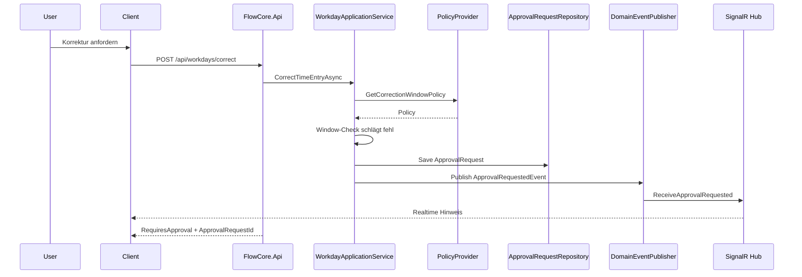

# Sequence — Correction Outside Policy (Mermaid)

```mermaid
sequenceDiagram
    participant U as User
    participant C as Client
    participant API as FlowCore.Api
    participant APP as WorkdayApplicationService
    participant POL as PolicyProvider
    participant AR as ApprovalRequestRepository
    participant EVT as DomainEventPublisher
    participant HUB as SignalR Hub

    U->>C: Korrektur anfordern
    C->>API: POST /api/workdays/correct
    API->>APP: CorrectTimeEntryAsync
    APP->>POL: GetCorrectionWindowPolicy
    POL-->>APP: Policy
    APP->>APP: Window-Check schlägt fehl
    APP->>AR: Save ApprovalRequest
    APP->>EVT: Publish ApprovalRequestedEvent
    EVT->>HUB: ReceiveApprovalRequested
    HUB-->>C: Realtime Hinweis
    API-->>C: RequiresApproval + ApprovalRequestId
```
