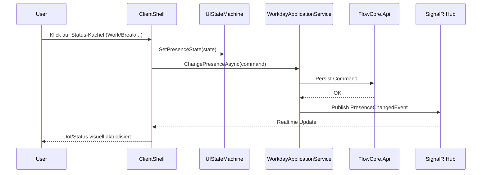

# Sequence — Book Time (Mermaid)

```mermaid
sequenceDiagram
    participant U as User
    participant C as ClientShell
    participant SM as UIStateMachine
    participant APP as WorkdayApplicationService
    participant API as FlowCore.Api
    participant HUB as SignalR Hub

    U->>C: Klick auf Status-Kachel (Work/Break/...)
    C->>SM: SetPresenceState(state)
    C->>APP: ChangePresenceAsync(command)
    APP->>API: Persist Command
    API-->>APP: OK
    APP->>HUB: Publish PresenceChangedEvent
    HUB-->>C: Realtime Update
    C-->>U: Dot/Status visuell aktualisiert
```
