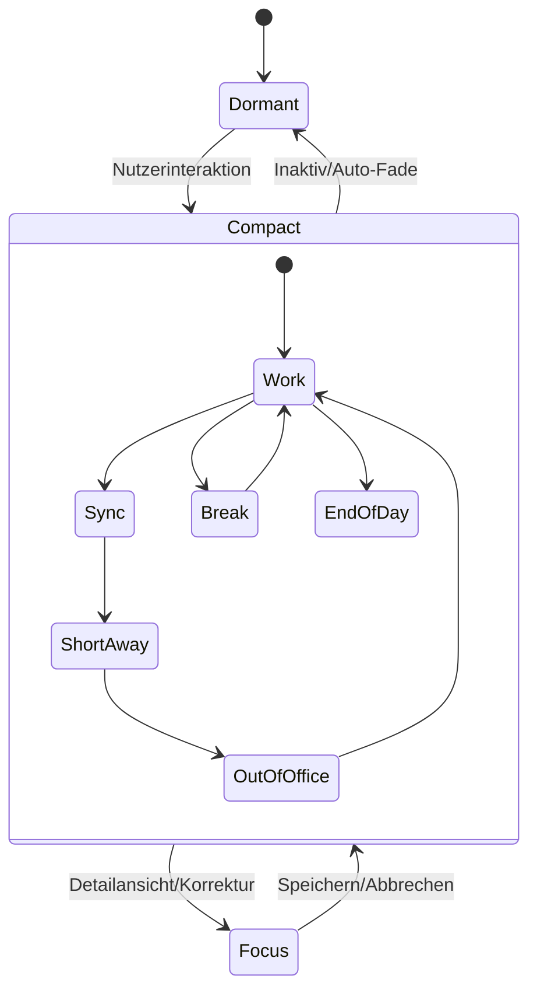

# Client State Machine (Mermaid)

```mermaid
stateDiagram-v2
    [*] --> Dormant
    Dormant --> Compact: Nutzerinteraktion
    Compact --> Focus: Detailansicht/Korrektur
    Focus --> Compact: Speichern/Abbrechen
    Compact --> Dormant: Inaktiv/Auto-Fade

    state Compact {
      [*] --> Work
      Work --> Sync
      Sync --> ShortAway
      ShortAway --> OutOfOffice
      OutOfOffice --> Work
      Work --> Break
      Break --> Work
      Work --> EndOfDay
    }
```
