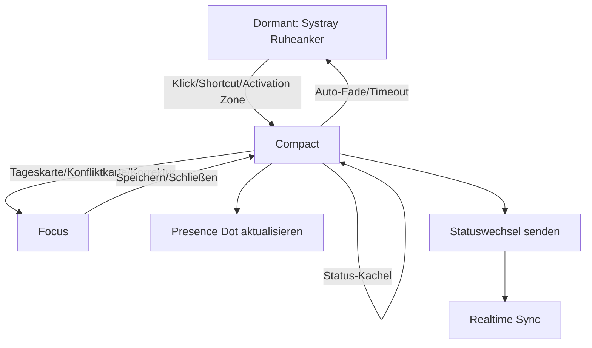

# UI Flow (Mermaid)

```mermaid
flowchart TD
    D[Dormant: Systray Ruheanker] -->|Klick/Shortcut/Activation Zone| C[Compact]
    C -->|Status-Kachel| C
    C -->|Tageskarte/Konfliktkarte/Korrektur| F[Focus]
    F -->|Speichern/Schließen| C
    C -->|Auto-Fade/Timeout| D

    C --> P[Presence Dot aktualisieren]
    C --> S[Statuswechsel senden]
    S --> R[Realtime Sync]
```
