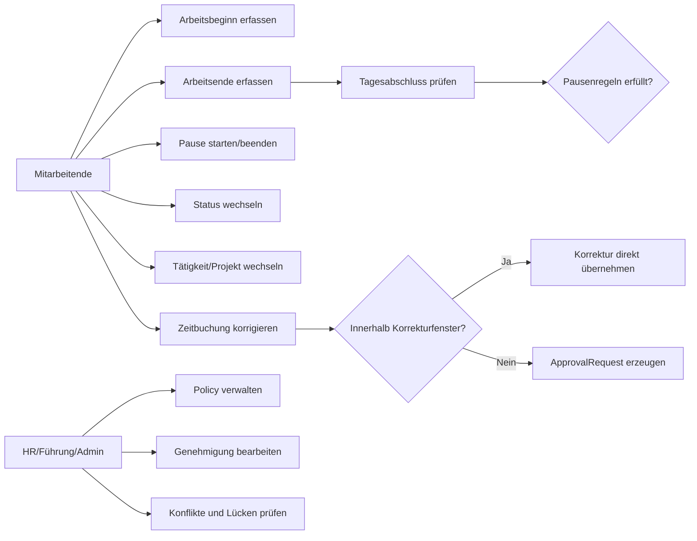

# Use Case Diagram (Mermaid)

```mermaid
flowchart LR
    User[Mitarbeitende] --> UC1[Arbeitsbeginn erfassen]
    User --> UC2[Arbeitsende erfassen]
    User --> UC3[Pause starten/beenden]
    User --> UC4[Status wechseln]
    User --> UC5[Tätigkeit/Projekt wechseln]
    User --> UC6[Zeitbuchung korrigieren]

    Admin[HR/Führung/Admin] --> UC7[Policy verwalten]
    Admin --> UC8[Genehmigung bearbeiten]
    Admin --> UC9[Konflikte und Lücken prüfen]

    UC6 --> UC10{Innerhalb Korrekturfenster?}
    UC10 -->|Ja| UC11[Korrektur direkt übernehmen]
    UC10 -->|Nein| UC12[ApprovalRequest erzeugen]

    UC2 --> UC13[Tagesabschluss prüfen]
    UC13 --> UC14{Pausenregeln erfüllt?}
```
